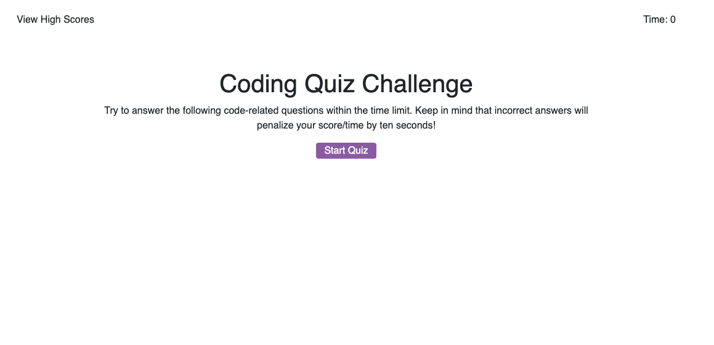

# code-quiz
Homework 4: Code Quiz

This homework assignment involved coding a multiple-choice quiz about coding. The quiz included a timer that was affected by how the user responded to the multiple-choice questions. I modeled my interface to match the one presented by the instructor. Some critial features were the following:
- start button that initiates the quiz
- timer that starts counting down when the quiz begins
- timer that subtracts 10 seconds for every question answered incorrectly
- questions that follow one another immediately after a user chooses an answer choice
- final score page 
- high score record keeping page that keeps track of user's high scores
- form that collects the initials of players with their scores

Overall, this project involved a great deal of javascript to power this tool. 

Link: https://masielb.github.io/code-quiz/

